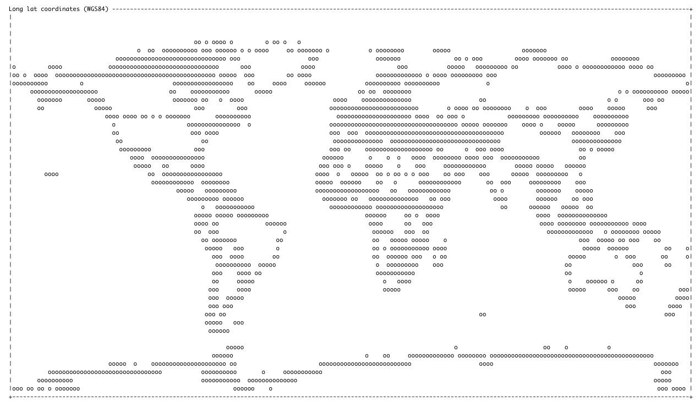

<!-- README.md is generated from README.Rmd. Please edit that file -->

```{r, include = FALSE}
suppressPackageStartupMessages({
  library(devout)
  library(ggplot2)
  library(dplyr)
  library(grid)
})
knitr::opts_chunk$set(
  collapse = FALSE,
  comment = "",
  fig.path = "man/figures/README-",
  out.width = "100%"
)


set.seed(1)
mtcars <- mtcars %>% 
  mutate(cyl = as.factor(cyl))

```
# devout - non-standard devices for graphical output from R

<!-- badges: start -->


<!-- badges: end -->


`devout` is a package for some of some non-standard devices for R.

A graphics device (e.g. `png()`, `pdf()`) is an interface to which R passes
plotting instructions. The graphics device then stores these in the appropriate
format for the given filetype.

However, there is no requirement that the output is saved to a file, nor is there
any requirement that the output is saved as a graphic.


## What's in the box

* `ascii()` - a non-standard device which outputs an ascii representation of the plot 
  to a file, or to the console or terminal
* `descriptive()` - a non-standard output device that describes what the output looks like


## News:

* v0.1.0 - initial release
* v0.1.1 
    - Added support for path objects, so more map plots now work.
    - More example plots - `sf`, `pie`, `igraph`

## Installation

You can install from [GitHub](https://github.com/coolbutuseless/devout) with:

``` r
# install.packages("remotes")
remotes::install_github("coolbutuseless/devout")
```


## `ascii()` device

The `ascii()` device draws an approximation of the graphics using ASCII characters
on the console (by default) or saved to a text file (if specified).

### `ggplot2`: Basic scatterplot

```{r}
p <- ggplot(mtcars) + 
  geom_point(aes(mpg, wt)) +
  labs(
    y     = "Car Weight",
    title    = "Basic scatter plot",
    subtitle = "Rendered with devout::ascii()"
  )  + 
  theme_bw()

ascii(width = 100)
p
jnk <- dev.off()
```


### `ggplot2` Facetted Histogram with a `fill` aesthetic

```{r eval = TRUE}
p <- ggplot(mtcars) + 
  theme_bw()  +
  geom_histogram(aes(wt, fill = cyl), bins = 5, colour = 'black') +
  labs(title = "Facetted Histogram with 'fill' Aesthetic", 
    subtitle = "Rendered with devout::ascii()") + 
  facet_wrap(~cyl, labeller = label_both) +
  theme(panel.grid = element_blank())

ascii(width = 100)
p
jnk <- dev.off()
```


### `geom_sf` map of the Gulf of Mexico

* Example taken from the [r-spatial website](https://www.r-spatial.org/r/2018/10/25/ggplot2-sf.html)
* This would probably look better with filled polygons, but they are not supported yet.

```{r warning = FALSE, eval = FALSE}
library(ggplot2)
library(sf)
library(rnaturalearth)
world <- ne_countries(scale = "medium", returnclass = "sf")

world_points <- st_centroid(world)
world_points <- cbind(world, st_coordinates(st_centroid(world$geometry)))

ascii(width = 200)
ggplot(data = world) +
  geom_sf() +
  geom_text(data= world_points,aes(x=X, y=Y, label=name),
            color = "darkblue", fontface = "bold", check_overlap = FALSE) +
  annotate(geom = "text", x = -90, y = 26, label = "Gulf of Mexico", fontface = "italic", color = "grey22", size = 6) +
  coord_sf(xlim = c(-102.15, -74.12), ylim = c(7.65, 33.97), expand = FALSE) + 
  theme_bw()
jnk <- dev.off()
```


### `tmap` world map

* Thanks to [Barry Rowlingson](https://twitter.com/geospacedman) for pointing out
that basic mapping didn't work in v0.1.0 and posting an example

```{r eval = FALSE}
library(tmap)
data(World)

ascii(verbosity = 0, width = 200)
tm_shape(World, projection = 'longlat') + 
  tm_polygons() +
  tm_layout("Long lat coordinates (WGS84)", inner.margins=c(0,0,.1,0))
dev.off()
```




### `treemap`

```{r echo = FALSE}
data(mtcars)
```


```{r}
library(treemap)

ascii(width = 100)
mtcars %>% 
  tibble::rownames_to_column() %>% 
  head(10) %>% 
  treemap(index = 'rowname', vSize = 'disp', palette = c('#ffffff'))
jnk <- dev.off()
```


### `igraph` network plot


```{r echo = FALSE}
set.seed(3)
```


```{r warning=FALSE, message=FALSE}
library(igraph)

ascii(width = 100)
igraph::random.graph.game(6, 0.4) %>% 
  plot(vertex.shape = 'none')
jnk <- dev.off()
```


### `pie` plot in base R

```{r}
ascii(width = 100) 
pie(1:3)
jnk <- dev.off()
```


## `descriptive()` device

The descriptive device gives a blow-by-blow account of what the graphics
device is being asked to draw.

This device is useful to use as a starting point for creating other graphics devices - 
I used it as the basis for the `ascii()` device and added featues as I needed them.


```{r}
p <- ggplot(mtcars) + 
  geom_point(aes(mpg, wt)) +
  labs(title = "Rendered with devout::ascii() more text goes here") +
  theme_void()

descriptive()
p
jnk <- dev.off()
```

## Limitations

* No filled polygons.
* No anti-aliasing.
* No UTF text support.
* No plotmath support.
* No angled text other than 0 or 90 degrees.
* No raster support.
* No sanity checking or safety checking of 'filename' string.
* No way to have un-filled circles.
* No stroke aesthetic for cicles.
* No real support for legends.
    * Legends get drawn, but a colourscale (for example) doesn't really map 
      to an ascii representation so it looks rubbish.
    * You should probably always add `theme(legend.position = 'none')` .
* No support for carriage returns in text.


## Other Non-Standard Device Ideas

* ANSI graphics
* Colour ASCII/ANSI output
* audio + midi output
* HPGL plotting output
* [CNC](https://en.wikipedia.org/wiki/Numerical_control) machine tooling instructions
* Directly drive motors to power an etch-a-sketch
* Crochet and knitting patterns
* Capture each call and turn it back into R code as a sequence of `grid` calls
* Save drawing instructions as a CSV file


## References:

* [svglite source code](https://github.com/r-lib/svglite)
* [thomasp85's](https://twitter.com/thomasp85) [devoid package](https://github.com/r-lib/devoid)
* The defunct `RGraphicsDevice` project
    * http://www.omegahat.net/RGraphicsDevice/
    * http://www.omegahat.net/RGraphicsDevice/overview.html

