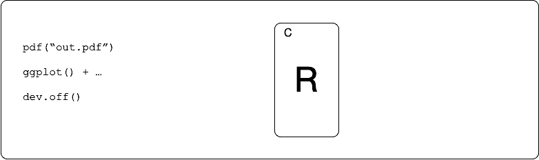
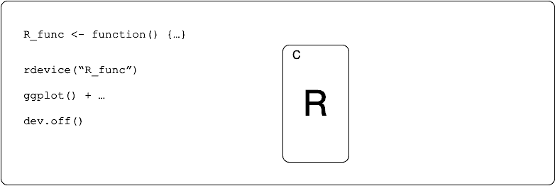
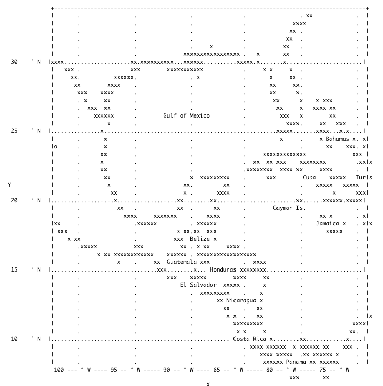

<!-- README.md is generated from README.Rmd. Please edit that file -->

# devout 

<!-- badges: start -->


 [](https://travis-ci.org/coolbutuseless/devout)
[](https://ci.appveyor.com/project/coolbutuseless/devout)
<!-- badges: end -->

`devout` is a package that enables R graphics devices to be written in
plain R.

`devout` uses a pseudo-graphics-device which translates graphics calls
into a call to an R function of your design.

This means we can create alternative output devices (like `pdf()` or
`png()`) using only plain R.

## How normal (C/C++) graphics devices work

<details open>
<summary>
<span title='animation'> animation (click to close)
</summary>

</details>

## How the devout device enables plain R graphics devices

<details open>
<summary>
<span title='animation'> animation (click to close)
</summary>

</details>

## What’s in the box

-   `rdevice()` - a generic device wrapper which will call the given R
    function to handle the graphics drawing.
-   Two example devices written in plain R (but using the underlying
    `rdevice()`)
    -   `descriptive()` - an output device which dumps information about
        the device calls.
    -   `ascii()` - a graphics device which outputs an ascii
        representation of the plot to a file, or to the console/terminal

## How do I write my own graphics device?

If you want to write your own graphics device in plain R using `devout`
you can:

1.  Read the `R/ascii-callback.R` included in the package
2.  Read the vignettes.

A series of 4 vignettes are included in this package. They walk through
the process of writing a naive SVG graphics device.

-   [Creating an SVG device - part 1 - The Callback
    Function](https://coolbutuseless.github.io/package/devout/articles/creating-an-svg-device-01.html)
-   [Creating an SVG device - part 2 - The Drawing
    Canvas](https://coolbutuseless.github.io/package/devout/articles/creating-an-svg-device-02.html)
-   [Creating an SVG device - part 3 - Rendering
    Graphics](https://coolbutuseless.github.io/package/devout/articles/creating-an-svg-device-03.html)
-   [Creating an SVG device - part 4 - %\#$^ you I won’t do what you
    tell
    me](https://coolbutuseless.github.io/package/devout/articles/creating-an-svg-device-04.html)

## Installation

You can install from [GitHub](https://github.com/coolbutuseless/devout)
with:

``` r
# install.packages("remotes")
remotes::install_github("coolbutuseless/devout")
```

# Simple device written in plain R: `debug` device

The following 5 lines of code are about the simplest device you can
write with `devout` in plain R.

This devices prints each of the device calls that were generated when
the plot was “drawn”.

``` r
#~~~~~~~~~~~~~~~~~~~~~~~~~~~~~~~~~~~~~~~~~~~~~~~~~~~~~~~~~~~~~~~~~~~~~~~~~~~~~
# Write a function which takes 3 arguments
# @param device_call name of device function call
# @param args the arguments to that device call
# @param state current state of the graphics device
#~~~~~~~~~~~~~~~~~~~~~~~~~~~~~~~~~~~~~~~~~~~~~~~~~~~~~~~~~~~~~~~~~~~~~~~~~~~~~
debug_function <- function(device_call, args, state) {
  if (device_call %in% c('mode', 'strWidthUTF8', 'metricInfo')) return()
  cat("[", device_call, "]: ")
  cat(paste(names(args), args, sep = " = ", collapse = ",  "), "\n", sep = "")
}
```

``` r
#~~~~~~~~~~~~~~~~~~~~~~~~~~~~~~~~~~~~~~~~~~~~~~~~~~~~~~~~~~~~~~~~~~~~~~~~~~~~~
# Call the 'rdevice' and tell it that all calls should be passed to 
# the above 'debug_function'
#~~~~~~~~~~~~~~~~~~~~~~~~~~~~~~~~~~~~~~~~~~~~~~~~~~~~~~~~~~~~~~~~~~~~~~~~~~~~~
rdevice(debug_function) 
plot(1:10)
invisible(dev.off())
```

    [ open ]: 
    [ activate ]: 

    [ holdflush ]: level = 1

    [ newPage ]: 
    [ clip ]: x0 = 59.04,  y0 = 502.56,  x1 = 689.76,  y1 = 59.04
    [ circle ]: x = 82.4,  y = 486.133333333333,  r = 2.7
    [ circle ]: x = 147.288888888889,  y = 440.503703703704,  r = 2.7
    [ circle ]: x = 212.177777777778,  y = 394.874074074074,  r = 2.7
    [ circle ]: x = 277.066666666667,  y = 349.244444444444,  r = 2.7
    [ circle ]: x = 341.955555555556,  y = 303.614814814815,  r = 2.7
    [ circle ]: x = 406.844444444445,  y = 257.985185185185,  r = 2.7
    [ circle ]: x = 471.733333333333,  y = 212.355555555556,  r = 2.7
    [ circle ]: x = 536.622222222222,  y = 166.725925925926,  r = 2.7
    [ circle ]: x = 601.511111111111,  y = 121.096296296296,  r = 2.7
    [ circle ]: x = 666.4,  y = 75.4666666666666,  r = 2.7
    [ clip ]: x0 = 0,  y0 = 576,  x1 = 720,  y1 = 0
    [ line ]: x1 = 147.288888888889,  y1 = 502.56,  x2 = 666.4,  y2 = 502.56
    [ line ]: x1 = 147.288888888889,  y1 = 502.56,  x2 = 147.288888888889,  y2 = 509.76
    [ line ]: x1 = 277.066666666667,  y1 = 502.56,  x2 = 277.066666666667,  y2 = 509.76
    [ line ]: x1 = 406.844444444445,  y1 = 502.56,  x2 = 406.844444444445,  y2 = 509.76
    [ line ]: x1 = 536.622222222222,  y1 = 502.56,  x2 = 536.622222222222,  y2 = 509.76
    [ line ]: x1 = 666.4,  y1 = 502.56,  x2 = 666.4,  y2 = 509.76
    [ textUTF8 ]: x = 129.288888888889,  y = 528.48,  str = 2,  rot = 0,  hadj = 0
    [ textUTF8 ]: x = 259.066666666667,  y = 528.48,  str = 4,  rot = 0,  hadj = 0
    [ textUTF8 ]: x = 388.844444444445,  y = 528.48,  str = 6,  rot = 0,  hadj = 0
    [ textUTF8 ]: x = 518.622222222222,  y = 528.48,  str = 8,  rot = 0,  hadj = 0
    [ textUTF8 ]: x = 642.4,  y = 528.48,  str = 10,  rot = 0,  hadj = 0
    [ line ]: x1 = 59.04,  y1 = 440.503703703704,  x2 = 59.04,  y2 = 75.4666666666666
    [ line ]: x1 = 59.04,  y1 = 440.503703703704,  x2 = 51.84,  y2 = 440.503703703704
    [ line ]: x1 = 59.04,  y1 = 349.244444444444,  x2 = 51.84,  y2 = 349.244444444444
    [ line ]: x1 = 59.04,  y1 = 257.985185185185,  x2 = 51.84,  y2 = 257.985185185185
    [ line ]: x1 = 59.04,  y1 = 166.725925925926,  x2 = 51.84,  y2 = 166.725925925926
    [ line ]: x1 = 59.04,  y1 = 75.4666666666666,  x2 = 51.84,  y2 = 75.4666666666666
    [ textUTF8 ]: x = 41.76,  y = 458.503703703704,  str = 2,  rot = 90,  hadj = 0
    [ textUTF8 ]: x = 41.76,  y = 367.244444444444,  str = 4,  rot = 90,  hadj = 0
    [ textUTF8 ]: x = 41.76,  y = 275.985185185185,  str = 6,  rot = 90,  hadj = 0
    [ textUTF8 ]: x = 41.76,  y = 184.725925925926,  str = 8,  rot = 90,  hadj = 0
    [ textUTF8 ]: x = 41.76,  y = 99.4666666666666,  str = 10,  rot = 90,  hadj = 0
    [ polygon ]: n = 4,  x = c(59.04, 689.76, 689.76, 59.04),  y = c(502.56, 502.56, 59.04, 59.04)
    [ clip ]: x0 = 0,  y0 = 576,  x1 = 720,  y1 = 0
    [ textUTF8 ]: x = 332.4,  y = 557.28,  str = Index,  rot = 0,  hadj = 0
    [ textUTF8 ]: x = 12.96,  y = 316.8,  str = 1:10,  rot = 90,  hadj = 0
    [ holdflush ]: level = -1

    [ close ]: 

# `ascii()` device

This is an example of a more complete graphics device. It is written in
plain R and relies on `devout` for all the interfacing with C++ and the
internals of R.

The `ascii()` device draws an approximation of the graphics using ASCII
characters on the console (by default) or saved to a text file (if
specified).

Limitations

-   No support for: filled polygons, plotmath, alpha blending, angled
    text, rasters
-   You should probably always add `theme(legend.position = 'none')`
    because legends look awful in ascii.

### `ggplot2`: Basic scatterplot

``` r
library(ggplot2)
library(devout)

p <- ggplot(mtcars) + 
  geom_point(aes(mpg, wt)) +
  labs(
    y     = "Car Weight",
    title    = "Basic scatter plot",
    subtitle = "Rendered with devout::ascii()"
  )  + 
  theme_bw()

ascii(width = 100)
p
invisible(dev.off())
```

        Basic scatter plot                                                                              
        Rendered with devout::ascii()                                                                   
        +----------------------------------------------------------------------------------------------+
        |  .#       .       #.        .        .         .        .        .        .        .         |
        O..............................................................................................|
      5 |  .        .        .        .        .         .        .        .        .        .         |
        |  .        .        .        .        .         .        .        .        .        .         |
        |..............................................................................................|
        |  .        .        .        .        .         .        .        .        .        .         |
    C 4 O.........................#....................................................................|
    a   |  .        .  #     .#       #      # .         .        .        .        .        .         |
    r   |..................#.#.#.......................................................................|
        |  .        .        .#       .##  # # .         .        .        .        .        .         |
    W   |  .        .        .  #     .        .     #   .#     # .        .        .        .         |
    e 3 O..........................................#...................................................|
    i   |  .        .        .        .       #.   # #   .        .        .        .        .         |
    g   |............................................#.................................................|
    h   |  .        .        .        .        .         .#       .        .        .        #         |
    t   O.............................................................#................................|
      2 |  .        .        .        .        .         .        .       #.        .        .     #   |
        |  .        .        .        .        .         .        .        .        . #      .         |
        |.............................................................................#................|
        +10O----------------15----------------20----------------25O----------------30----------------35O
                                                     mpg                                                
                                                                                                         

### `pie` plot in base R

``` r
ascii(width = 100) 
pie(c(cool = 4, but = 2, use = 1, less = 8))
invisible(dev.off())
```

                                                                                                        
                                                                                                        
                                                                                                        
                                       but     ##############                                           
                                           ####    #         ####  cool                                 
                                        ###        #             ###                                    
                                      ##            #               ##                                  
                              use    ## ###         #                ##                                 
                                   ##      ###      #                  #                                
                                   #          ###    #                  #                               
                                   #########     ### #                  #                               
                                  #         ##############################                              
                                  #                                     #                               
                                   #                                    #                               
                                   ##                                  ##                               
                                    ##                                ##                                
                                     ##                              ##                                 
                                      ###                          ###                                  
                                        ####                    ####                                    
                                           #####            #####                                       
                                                #############                                           
                                              less                                                      
                                                                                                        
                                                                                                        
                                                                                                         

### `geom_sf()` map of the Gulf of Mexico

<details closed>
<summary>
<span title='Simple features example'> geom\_sf() example (click to
open)
</summary>

-   Example taken from the [r-spatial
    website](https://www.r-spatial.org/r/2018/10/25/ggplot2-sf.html)
-   This would probably look better with filled polygons, but they are
    not supported yet.

``` r
library(ggplot2)
library(sf)
library(rnaturalearth)
world <- ne_countries(scale = "medium", returnclass = "sf")

world_points <- st_centroid(world)
world_points <- cbind(world, st_coordinates(st_centroid(world$geometry)))

ascii(width = 200)
ggplot(data = world) +
  geom_sf() +
  geom_text(data= world_points,aes(x=X, y=Y, label=name),
            color = "darkblue", fontface = "bold", check_overlap = FALSE) +
  annotate(geom = "text", x = -90, y = 26, label = "Gulf of Mexico", fontface = "italic", color = "grey22", size = 6) +
  coord_sf(xlim = c(-102.15, -74.12), ylim = c(7.65, 33.97), expand = FALSE) + 
  theme_bw()
invisible(dev.off())
```



</details>

<br />

## Ideas for other Output Devices

-   Colour ASCII/ANSI output
-   Audio output
-   HPGL plotting output
-   [CNC](https://en.wikipedia.org/wiki/Numerical_control) machine
    tooling instructions
-   Directly drive motors to power an etch-a-sketch

## News:

-   v0.2.0 - Major refactor. `devout` is now a way of writing graphics
    devices in plain R with the `ascii()` device as an example.
-   v0.1.2 - Added support for multiple page output
-   v0.1.1 - Added support for path objects, so more map plots now work.
-   v0.1.0 - initial release
