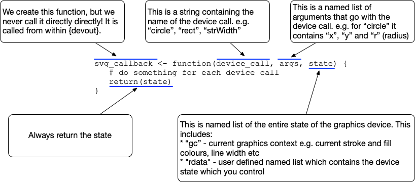

```{r, include = FALSE}
suppressPackageStartupMessages({
  library(dplyr)
  library(xml2)
  library(devout)
  library(glue)
  library(ggplot2)
})

knitr::opts_chunk$set(
  collapse = TRUE,
  comment  = "#>",
  dev      = "svglite",
  fig.ext  = ".svg"
)
```

Introduction
==============================================================================

This series of vignettes will walk through the process of creating a very basic SVG
output device using `devout`.

The only code to be written is R code.  All the tricky C/C++ code is taken care
of within `devout`.

Vignettes in this series:

1. This vignette. 
    * What does the required R function look like? 
    * What are the arguments?
    * Creating a debugging example
2. Setting up a 'canvas' upon which to write the SVG
3. Adding support for device calls which draw on the canvas
4. Simple experimentation

```{r setup}
library(devout)
```


Overview of the Callback Function
==============================================================================

When using the `devout` output device, instead of passing the drawing calls to
some C/C++ code for creating an image, the drawing calls are passed to a nominated
R *callback* function.

This callback function is never called from R, instead when the `devout` device
is initiated we pass in the name of this function.  This function is then called
from deep within R during the plotting process.

An example of the format of a callback function for use with `devout` is shown 
below.  Note: this callback doesn't actual do anything as it returns the `state`
unchanged.

```{r}
svg_callback <- function(device_call, args, state) {
  # do something for each device call
  return(state)
}
```

An overview of the callback function is as follows:




The name of the callback function is given to the `devout` device, and the standard
use would look something like the following:

```{r eval=FALSE}
devout::rdevice("svg_callback")
plot(1:10)
dev.off()
```


A Simple Callback Function
==============================================================================

This section describes the simplest useful callback function.

All this version of the callback function does is print the name of the device call 
that was requested.  There is no attempt at any graphical output or even doing 
anything in response to the type of call.


```{r}
svg_callback <- function(device_call, args, state) {
  cat(device_call, " ")
  return(list())
}
```


```{r eval = FALSE}
rdevice("svg_callback", width = 1000) 
plot(1:10)
invisible(dev.off())
```

```{r echo = FALSE}
rdevice("svg_callback", width = 1000) 
plot(1:10)
invisible(dev.off())
```


Things to note in the output:

* Starts with an `open` and ends with a `close`
* The 10 circles drawn early on - these are the 10 points of the plot
* `strWidth` calls are the R system asking how wide a particular string is 
  rendered in the current state
* `textUTF8` writes some text to the device


What are all the device calls?
==============================================================================

`devout` includes a data object called `devinfo` which contains information 
about R devices.

To see some information about a device call e.g. `circle`

```{r}
devinfo$device_call$circle$desc

devinfo$device_call$circle$args
```


For a list of all the device calls:

```{r}
names(devinfo$device_call)
```


